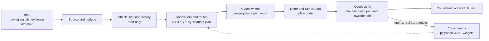

<div align="center">

# voidrip-gtm-engine

### VOIDRIP outbound orchestration with Codex. Source adapters supply candidates, Codex evaluates and writes, and execution adapters hold every activation behind human approval.


**Max and Overloop are optional bundled adapters. [Codex](https://developers.openai.com/codex/) is the qualification and orchestration engine.**

</div>

---

A buying signal tells you who to look at this week. It doesn't tell you what to say, and some signals you can never say out loud. When we ran this on our own max account, 92 of the first 100 leads came from someone connecting with a person on a competitor's sales team. That's great timing, and it can never appear in an email.

voidrip-gtm-engine is the execution loop around the persistent Market Map. Codex makes the qualification and messaging judgments; deterministic code validates them, keeps activation locked, and records results for learning. The repository does not call a model API directly: it is driven by the authenticated Codex client through MCP.

```
max finds them. Codex decides and writes. Code checks. You approve.
```

## Contents

1. [How it works](#how-it-works)
2. [Install and run, step by step](#install-and-run-step-by-step)
3. [Connect your agent](#connect-your-agent)
4. [What Codex decides](#what-codex-decides)
5. [Replies](#replies)
6. [Learning from results](#learning-from-results)
7. [Command reference](#command-reference)
8. [Configuration](#configuration)
9. [Free vs max](#free-vs-max)
10. [Verifying it](#verifying-it)
11. [Safety and privacy](#safety-and-privacy)
12. [Troubleshooting](#troubleshooting)
13. [Who built this](#who-built-this)

---

## How it works



### The daily loop (`/gtm-daily-loop`)

| # | Stage | Who does it | Tools |
|---|---|---|---|
| 0 | **Preflight:** both platforms reachable, send mode, seller profile | code | `gtm_doctor` |
| 1 | **Learn from yesterday:** sync engagement, analyze, update the playbook and weights | code + Codex | `gtm_sync_results` → `gtm_get_performance` → `gtm_save_learnings` |
| 2 | **Replies:** detect, fetch the text, sort, draft an answer | code + Codex | `gtm_get_reply_queue` → `gtm_ingest_reply` → `gtm_save_reply_triage` |
| 3 | **Source:** new max leads, deduped, each checked against Overloop | code | `gtm_source_leads` |
| 4 | **Tier and route:** A / B / C / DQ, persona, intent, route, channel plan, angle | Codex | `gtm_get_classification_queue` → `gtm_save_classifications` |
| 5 | **Write:** one sequence per person, a seven-point self-check, then the linter | Codex (+ parallel subagents) | `gtm_get_drafting_queue` → `gtm_save_sequence` |
| 6 | **Push:** the prospect plus one switched-off campaign per lead, with the exact copy | code | `gtm_push_to_overloop` → `gtm_verify_overloop` |
| 7 | **Review:** a human reads, approves and launches. Never automatic | you | `gtm_review_queue` → `gtm_approve` → `gtm_launch` |
| 8 | **Report:** the daily brief in `reports/YYYY-MM-DD.md` | code | `gtm_write_report` |

The next morning, the new playbook and weights shape steps 4 and 5. That's the loop.

### The folder

```
voidrip-gtm-engine/
  AGENTS.md                   the repository rules Codex follows
  .mcp.json                   registers the voidrip-gtm-engine MCP server
  .agents/skills/             gtm-daily-loop, gtm-classify-route, gtm-write-sequence,
                              gtm-replies, gtm-learn, gtm-local-e2e
  data/playbook.md            tiers, routing and writing rules (seed; versions live in the database)
  bin/                        gtm.mjs (CLI) and gtm-mcp.mjs (MCP server), TypeScript run through tsx
  src/clients/                max.ts, overloop.ts, http.ts (rate limits, retries, 429 backoff)
  src/safety/guard.ts         SendGuard, the only door to an Overloop write
  src/db/db.ts                SQLite through node:sqlite, migrations run by themselves
  src/pipeline/               source, enrich, route, classify, sequence, push, results,
                              replies, analytics, learn, playbook, weights, report
  src/tools.ts                42 tools, one registry shared by the MCP server and the CLI
  scripts/                    daily.sh, daily.ps1, schedule.ps1, safety-check.ts, mcp-smoke.mjs
  tests/                      guard, routing and lint, channel plans, replies and launch, full pipeline
```

---

## Install and run, step by step

**You need:** Node.js 22.13 or newer, Codex, and credentials only for the source and execution adapters you actually enable. The bundled Max and Overloop adapters are optional.

### Step 1 - Get the code

```bash
git clone https://github.com/miraeeon/voidrip-gtm-engine.git
cd voidrip-gtm-engine
npm ci
codex mcp add voidrip-gtm-engine -- node "$PWD/bin/gtm-mcp.mjs"
alias gtm="node bin/gtm.mjs"
```

### Step 2 - Run the setup wizard

```bash
npm run setup
```

One guided pass, safe to re-run (press Enter to keep a value). It creates `.env` from `.env.example`, asks for your max and Overloop keys and tests both live, picks your business in max (type its id, or paste your website and max suggests an ICP), creates the database, saves your seller profile, and sets the schedule and daily caps.

> The seller profile is the file to take your time on. Its proof points are the only numbers Codex is allowed to use in outreach. Any percentage, multiplier or "far more" claim that isn't there gets flagged by the linter.

### Step 3 - Check everything is green

```bash
npm run doctor
```

```json
{
  "send_mode": "locked",
  "max":      { "ok": true, "business": "Acme (https://acme.com)", "icp": "configured", "active_subscriptions": 2 },
  "overloop": { "ok": true, "user": "Jane Doe <jane@acme.com>", "working_senders": 3 },
  "system":   { "database": { "ok": true }, "agent_cli": { "ok": true }, "schedule": { "installed": true, "next_run": "…08:00" } }
}
```

### Step 4 - Turn on the signals that matter

```bash
gtm setup                                   # your ICP, current subscriptions, every signal and its config
gtm subscribe social-mentions --name "Posts about outbound pain" \
  --config '{"keywords":["cold email not working","outbound prospecting"],"posted_limit":"P1W"}'
gtm subscribe job-changes --name "New sales leaders"
```

A fresh subscription can take a few hours before its first leads.

### Step 5 - Run the loop once and watch it

Open the folder in Codex (`codex`). Codex reads `AGENTS.md` and discovers the five repository skills. Then ask:

```
Use the gtm-daily-loop skill and run today's loop.
```

> **What you should see:** Codex sources the new leads, tiers them, writes a sequence for each one worth a message and pushes them to Overloop as switched-off campaigns. The brief lands in `reports/`. Nobody is enrolled and nothing is sent.

### Step 6 - Read before anything goes out

```bash
gtm review           # every drafted campaign, with the literal copy and its Overloop link
gtm report           # today's brief
gtm replies          # hot replies first, with drafted answers
```

Read the DQs first: they tell you quickly whether Codex understood who you sell to. Then read three campaigns the way the prospect would. When a line could go to someone else, change the rule in `data/playbook.md` and run `gtm playbook --reload`, so every lead after it gets the fix.

### Step 7 - Make it yours

| Want to change… | Edit |
|---|---|
| How leads are tiered and routed, and the writing rules | `data/playbook.md`, then `gtm playbook --reload` (or let the learn step do it) |
| What your company may claim | `gtm seller --set …` (proof points are the only numbers allowed) |
| The self-check or the daily steps | `.agents/skills/*/SKILL.md` |
| Lint rules (length, spam words, clichés, claims) | `src/pipeline/sequence.ts` → `lintSequence` |
| The routing rules code enforces | `src/pipeline/route.ts` |

### Step 8 - Go live (when you mean it)

Before you switch: warm up your sending addresses in Overloop, set `OVERLOOP_SENDER_ID` to the Overloop user you want to send as, connect a LinkedIn account in Overloop for the LinkedIn steps, check the proof points, and read at least 20 sequences in `gtm review`. Then:

```bash
# in .env
SEND_MODE=live

gtm approve 123 456                 # approve specific campaigns (--revoke to undo)
gtm launch 123 456 --confirm SEND   # enroll and activate the approved ones
```

`launch` only takes approved campaigns and the word SEND. Right before it enrolls anyone, it checks Overloop again and skips whoever replied, bounced or got excluded since the push. In Codex, approve and launch always ask you first.

> Read ten drafts back to back first. `SEND_MODE=live` is a deliberate choice, never the default.

### Step 9 - Put it on a schedule

```bash
npm run schedule
```

This installs the schedule from `.env` (weekdays at 08:00 by default): cron on macOS and Linux, Task Scheduler on Windows. Each run takes a lock, backs up the database, then starts Codex non-interactively in a read-only shell sandbox:

```bash
GTM_UNATTENDED=1 codex exec --sandbox read-only -
```

The scheduled run sources, tiers, writes, pushes switched-off campaigns, sorts replies, learns and writes the brief. With `GTM_UNATTENDED=1`, the MCP server does not expose approval, launch, cleanup, simulation or source-configuration mutations. Keep scheduled runs in locked mode. Logs go to `reports/run-*.log`.

---

## Connect your agent

The engine is a standard MCP server over stdio: `node bin/gtm-mcp.mjs`.

**Codex.** Register the server once with an absolute path:

```bash
codex mcp add voidrip-gtm-engine -- node /absolute/path/to/voidrip-gtm-engine/bin/gtm-mcp.mjs
```

Codex reads `AGENTS.md` and the skills under `.agents/skills/`.

**Other MCP clients.**

```json
{
  "mcpServers": {
    "voidrip-gtm-engine": { "command": "node", "args": ["/absolute/path/to/voidrip-gtm-engine/bin/gtm-mcp.mjs"] }
  }
}
```

The server also exposes a `daily-loop` prompt and two resources, `gtm://playbook` and `gtm://status`.

**No MCP?** Every tool runs from the shell with the same JSON, so any agent that can run a command can drive it:

```bash
gtm tools
gtm tool gtm_get_drafting_queue '{"limit":5}'
gtm classify @classifications.json
gtm sequence @sequences.json
```

---

## What Codex decides

### Tier, route and a channel plan

For every lead, Codex reads the evidence max attached, the channels you actually have for that person, their Overloop history, the seller profile, the playbook, the weights and the latest learnings. It decides:

| Field | What Codex decides |
|---|---|
| `tier` | A, B, C or DQ. In doubt between B and C it picks C, between C and DQ it picks DQ |
| `persona` | a short reusable label, like `head-of-growth`, so results can be grouped |
| `intent_strength` | 1 to 5, from what the signal actually says |
| `route` | email, LinkedIn or both |
| `channel_plan` | which channel opens, and what each channel carries |
| `angle` | the one thing to lead with |

With `both`, each channel gets its own job. One real plan from our run:

```json
{ "first_channel": "linkedin",
  "linkedin": { "role": "lead", "content": "Connect note about growing a consultancy's pipeline, then a message asking which client profile they target" },
  "email": { "role": "support", "content": "After connect: concise how-it-works email with one proof point and a 1-pager offer" },
  "why": "Head of Growth at 11-50 is active on LinkedIn; signal happened on LinkedIn; email follows as the detailed track" }
```

Then `route.ts` checks the choice against what's actually possible, and code wins:

| The lead | Route after the code |
|---|---|
| DQ | none |
| on the Overloop exclusion list | none |
| already replied in Overloop | none, a human takes it |
| no deliverable email and no LinkedIn profile | none |
| bounced or invalid email | LinkedIn |
| no LinkedIn profile | email |

### Signals you can say, and signals that only tell you when

| Signal | Say it? | How Codex uses it |
|---|---|---|
| A public post or comment | yes, the topic | open with their point, add a view |
| Funding, hiring, M&A, a tender | yes, it's public news | a short congrats, then the problem it creates |
| A new role | lightly | congrats on the role, then what they'll likely prioritize |
| Reactions to company or influencer posts | the topic only | lead with the topic, never "I saw you liked" |
| Connected to a competitor's sales team | never | timing only, lead with the pain of their role |
| A visit to your website | never | timing only, lead with their company |
| ICP match, nothing else | nothing to say | one specific observation about their company |

### Writing, then checking

Codex drafts each sequence, checks it against seven questions, fixes what fails, and saves it:

```
1. hook        does the first touch come from the lead data, and only from it
2. only them   could this opener go to anyone else unchanged
3. bridge      signal to value in one plain sentence
4. CTA         one low-friction question, no calendar link in email 1
5. length      playbook limits, no clichés, no hype, no signature
6. follow-ups  each one adds something new
7. truth       every claim is in the seller profile or the lead data
```

It writes in the prospect's language when the location makes it obvious. Then `gtm_save_sequence` runs the linter, plain code in `sequence.ts`:

```
error    a leftover placeholder like {{first_name}}
error    the first message on a different channel than the plan
error    steps that don't match the route
error    a LinkedIn note over 300 characters, or a link in it
warn     spam words, and clichés like "just checking in" or "circling back"
warn     a first touch that names neither the person nor their company
warn     a percentage, a multiplier or "far more" that isn't a proof point
```

With an error the sequence stays a draft and can't be pushed. A warning goes back to Codex as a judgment call. Past ten leads, the skill splits the queue into batches of five to eight for the `sequence-writer` subagent, which has no push tool.

### Push, switched off

Every campaign is created like this, one per lead, holding the exact copy:

```json
{ "status": "off", "only_allow_manual_enrollment": true,
  "automatically_send_messages": false, "automatically_send_follow_ups": false, "automatically_reenroll": false }
```

One campaign per lead keeps every message readable and editable inside Overloop. They share a name prefix (`OVERLOOP_NAME_PREFIX`), so `gtm cleanup` can list everything the bot made and delete it.

---

## Replies

`gtm sync` sees who replied in Overloop, and Codex reads the text from your Gmail or Outlook MCP. For a LinkedIn reply, or with no mailbox connected, it lists the names and asks you to paste the text (`gtm reply-add --lead <id> --text "…"`). It never guesses what someone said.

Each reply goes into one of ten buckets:

```
interested       question        objection        not now          referral
not interested   unsubscribe     out of office    wrong person     other
```

For each one, Codex writes a one-line summary, the next step for a human, and a drafted answer in the prospect's language, using only the seller profile. If the answer isn't there (pricing, for example), it says so and tells you what to add. Code handles the safe follow-ups: an unsubscribe goes on the Overloop exclusion list, any human answer stops the sequence, and a hot reply gets the conversation assigned to a person. The answer itself waits in `gtm replies` for you to send.

---

## Learning from results

`gtm sync` pulls opens, clicks, replies and bounces from Overloop, counting only what happened after the push. `gtm performance` breaks reply, positive-reply and meeting rates down by signal, tier, persona, route, first channel, hook type, intent and playbook version.

Then Codex writes the learnings: each finding with the numbers behind it and a confidence level, new weights, and the full playbook rewritten and saved as a new version. The skill caps a weight move at 0.3 a day (0.1 on a small sample), and code clamps every weight between 0 and 3. Buckets with too few contacts are flagged, and the loop refuses to conclude from them.

Test data is labelled everywhere it shows up: `gtm simulate` and `gtm simulate-replies` exist to exercise the loop, and their rows are flagged simulated in the database, the performance numbers and the brief.

---

## Command reference

```
gtm doctor | status | tools
gtm init --website <url> | --business <id>
gtm setup [--no-catalog]
gtm subscribe <signal> --name <n> --config <json>
gtm seller [--set <json|@file>]
gtm source [--pages n]        gtm enrich
gtm queue [--limit n]         gtm classify <json|@file|->
gtm drafts [--limit n]        gtm sequence <json|@file|->
gtm push [--limit n]          gtm verify
gtm review [--limit n]
gtm approve [leadIds…] [--revoke]
gtm launch [leadIds…] --confirm SEND          # sends, live mode only
gtm sync | performance [--real-only]
gtm replies | reply-queue | reply-add --lead <id> --text "…"
gtm triage <json|@file> | resolve <replyId> [--meeting]
gtm learn <json|@file> | playbook [--reload]
gtm report [--date YYYY-MM-DD]
gtm daily | schedule [install|remove] | backup
gtm cleanup [--yes]
gtm simulate [--seed n] | simulate-replies [--count n]     # test data, flagged simulated
gtm tool <name> [json]
```

Run through `node bin/gtm.mjs …`, the alias from step 1, or `npm link` once for a global `gtm`.

### The 42 tools

| Tool | What it does | Writes? |
|---|---|---|
| `gtm_doctor` | Connectivity to max and Overloop, business, senders, send mode | no |
| `gtm_status` | Leads by stage, pushes, outcomes, playbook version, blocked events | no |
| `gtm_init` | Set up a company in max from its website (max suggests the ICP) | max |
| `gtm_setup` | ICP, subscriptions, the full signal catalog with config schemas, weights | no |
| `gtm_update_icp` | Patch the max ICP | max |
| `gtm_manage_subscription` | Create, pause or resume a max signal subscription | max |
| `gtm_seller_profile` | Get or set value prop, proof points, CTA, tone, language, do-not-say | local |
| `gtm_source_leads` | Pull new max leads (deduped) and check them against Overloop | local |
| `gtm_enrich_from_overloop` | Read-only lookup of each lead in Overloop | local |
| `gtm_ingest_candidates` | Add a normalized CSV/JSON batch to the persistent Market Map | local |
| `gtm_get_resolution_queue` | Candidates needing Person + Project resolution | no |
| `gtm_save_project_resolution` | Save project identity, visibility, alignment and evidence | local |
| `gtm_get_boundary_queue` | Resolved Person + Project records ready for GTM_BOUNDARY_V1 | no |
| `gtm_save_boundary_qualifications` | Save PASS/HOLD/FAIL independently from intent | local |
| `gtm_get_priority_queue` | PASS_OUTBOUND_V1 records needing intent and priority | no |
| `gtm_save_activation_scores` | Save intent, freshness, priority, route and angle | local |
| `gtm_get_market_drafting_queue` | Activation-ready records for local drafting | no |
| `gtm_save_candidate_sequence` | Lint and version a local Person + Project sequence | local |
| `gtm_get_market_review_queue` | Final local drafts awaiting human review | no |
| `gtm_get_classification_queue` | Leads with evidence, seller profile, playbook, weights, learnings | no |
| `gtm_save_classifications` | Tier, persona, intent, route, channel plan, angle; routing rules applied | local |
| `gtm_get_drafting_queue` | Everything needed to write: evidence, plan, template, past winners, lint | no |
| `gtm_save_sequence` | Validate, lint and store (draft or final) | local |
| `gtm_push_to_overloop` | Prospect plus a switched-off campaign per lead | Overloop |
| `gtm_verify_overloop` | Read every bot campaign back: status and enrollments | no |
| `gtm_review_queue` | Pushed campaigns awaiting review, with the copy and Overloop links | no |
| `gtm_approve` | Approve (or revoke) campaigns for launch | local |
| `gtm_launch` | Enroll and activate approved campaigns (live mode and `confirm: "SEND"`) | Overloop |
| `gtm_sync_results` | Opens, clicks, replies, bounces since the push; detects new replies | local |
| `gtm_ingest_reply` | Attach a reply's text (from a mailbox MCP or you) | local |
| `gtm_get_reply_queue` | Replies to sort, with what we sent, and replies still missing text | no |
| `gtm_save_reply_triage` | Category, summary, next step, drafted answer, then the safe follow-ups | local + Overloop (safe) |
| `gtm_reply_inbox` | Replies waiting on a human, hottest first, with drafts | no |
| `gtm_resolve_reply` | Close a reply (`meeting_booked` feeds learning) | local |
| `gtm_simulate_replies` | Test only: realistic replies, flagged simulated | local |
| `gtm_record_outcome` | Record positive replies and meetings the API can't see | local |
| `gtm_simulate_results` | Test only: reproducible outcomes, flagged simulated | local |
| `gtm_get_performance` | Rates by signal, tier, persona, route, first channel, hook, intent, version | no |
| `gtm_get_playbook` | Current playbook and version | no |
| `gtm_save_learnings` | Insights, playbook rewrite, weights, max subscription suggestions | local (+ max if applied) |
| `gtm_write_report` | The daily brief | local |
| `gtm_cleanup_overloop` | Delete bot-created objects (dry run by default) | Overloop |

---

## Configuration

`npm run setup` fills in the essentials, and everything else has a default. The full reference is in [docs/CONFIGURATION.md](docs/CONFIGURATION.md).

| Group | Key settings (default) |
|---|---|
| **Bundled adapters** | `MAX_API_KEY`, `OVERLOOP_API_KEY`, `MAX_BUSINESS_ID` (only required when using the bundled Max/Overloop adapters) |
| **Safety** | `SEND_MODE` (`locked`), `OVERLOOP_NAME_PREFIX` (`[GTM-BOT]`) |
| **Schedule** | `GTM_SCHEDULE_TIME` (`08:00`), `GTM_SCHEDULE_DAYS` (`MON…FRI`), `GTM_AGENT_CMD` (`codex`), optional `GTM_MODEL`, `GTM_RUN_TIMEOUT_MIN` (`90`) |
| **Daily volume** | `GTM_DAILY_NEW_LEADS` (`40`), `GTM_DAILY_SEQUENCES` (`25`), `GTM_DAILY_PUSH_LIMIT` (`25`), `GTM_SOURCE_MAX_PAGES` (`10`) |
| **Sending window** | `OVERLOOP_SENDING_DAYS` (`MON…FRI`), `OVERLOOP_SEND_START` (`09:00`), `OVERLOOP_SEND_END` (`17:00`), `OVERLOOP_TIMEZONE`, `OVERLOOP_SENDER_ID` |
| **Storage** | `GTM_DB_PATH` (`data/gtm.db`), `GTM_REPORTS_DIR`, `GTM_BACKUP_DIR`, `GTM_BACKUP_KEEP` (`14`), `GTM_LOG_RETENTION_DAYS` (`30`) |

After changing the schedule, run `npm run schedule` again.

**Several companies or clients.** Use one checkout per company (each gets its own schedule entry), or one env file per company with `GTM_ENV_FILE=clients/acme.env`, each with its own `GTM_DB_PATH`, `GTM_REPORTS_DIR` and `MAX_BUSINESS_ID`. Playbooks, weights and learnings stay separate. The runbook for backups, upgrades and multi-client setups is [docs/OPERATIONS.md](docs/OPERATIONS.md).

---

## Free vs max

The repo takes you from a buying signal to a sequence written for one person, waiting in Overloop for your yes. At volume, the daily watch is what takes the real time: following your signals every morning and deciding who is worth a message today. That is what we build at Sortlist.

| | **voidrip-gtm-engine** (free, you run it) | **[max](https://yourmax.ai)** (fully managed) |
|---|---|---|
| **Signals** | your max subscriptions, pulled each morning | watched for you 24/7 |
| **Who to contact** | Codex tiers and routes, with your playbook | a fresh ranked list every morning, with why each one is there and the evidence attached |
| **Outreach** | Codex writes, Overloop AI holds it, you approve | leads pushed straight into Overloop AI |
| **Cost** | your Codex plan, plus your max and Overloop plans | paid |

---

## Verifying it

```bash
npm test                          # vitest: SendGuard, routing and lint, channel plans, replies and launch, full pipeline (mocked APIs)
npm run typecheck                 # tsc --noEmit
node scripts/mcp-smoke.mjs        # starts the MCP server over stdio, lists the tools, calls gtm_status
gtm verify                        # reads every bot campaign back from Overloop: all off, nobody enrolled
npx tsx scripts/safety-check.ts   # live negative test on your Overloop: tries to enroll, activate, auto-send; all blocked
```

`npm run check` runs the first three in one go.

---

## Safety and privacy

- **Locked by default.** In `SEND_MODE=locked`, every Overloop write goes through `SendGuard`, which throws before the request leaves your machine if the call could send anything: enrolling a prospect (single or bulk), switching a campaign on, turning on auto-send, auto follow-ups or auto re-enroll, turning off manual-only enrollment, attaching a sourcing or search criteria, adding an `enroll_campaign` step, or replying on a conversation. Every attempt, allowed or blocked, goes into an audit table, and the brief lists the blocked ones.
- **Live mode still asks per call.** With `SEND_MODE=live`, a send-capable call also needs an explicit send flag on that one call. Two commands carry it: `gtm launch --confirm SEND`, which only takes approved campaigns and re-checks each person first, and `gtm push --force-enroll`, which enrolls at push time for manual use. Use `launch`.
- **People who replied belong to a human.** Anyone who already replied or sits on your Overloop exclusion list is never put into a new sequence, whatever the model decides.
- **Lead data is data.** Names, posts and company summaries are treated as content, never as instructions.
- **No invented facts.** Outreach uses the lead data and the seller profile's proof points only, and the linter flags any claim outside them.
- **Local state stays local.** Keys live in `.env`. Leads, sequences and results live in `data/gtm.db`. `.env`, the database, backups, `data/runs/` and `reports/` are all git-ignored, because they hold keys and real people's data. Anyone who replied or is excluded is never auto-sequenced. You remain responsible for your lawful basis for outreach where you operate.

---

## Troubleshooting

| Problem | Fix |
|---|---|
| max: `422 Active can only be enabled once your subscription is active` | The business has no active plan, so subscriptions can't be switched on. Activate a plan in max, or run `gtm init --business <id>` for one that has one. `gtm doctor` shows active subscriptions. |
| Overloop: `Your API key is wrong` | Overloop expects the raw key in `Authorization` (no `Bearer`). Check `.env` for quotes or trailing spaces. |
| No new leads from max | Signals are watched asynchronously, so a fresh subscription can take hours. Check `gtm setup` for active subscriptions, and add `atlas-icp` (ICP matches) to top up. |
| `Max adapter is not configured` | Run `npm run setup`, fill `MAX_API_KEY`, or inject another `SourceAdapter`. |
| `Overloop adapter is not configured` | Fill `OVERLOOP_API_KEY`, or inject another `ExecutionAdapter`. |
| A reply shows up without text | Connect a Gmail or Outlook MCP, or paste it with `gtm reply-add --lead <id> --text "…"`. |
| Too many campaigns in Overloop | Lower `GTM_DAILY_PUSH_LIMIT`, and use `gtm cleanup` (dry run) then `gtm cleanup --yes` to remove bot-created test objects. |
| Do I need an Anthropic or OpenAI API key? | No. The agent you already run is the model. The engine never calls a model API. |

---

## Who built this

[Nicolas Finet](https://be.linkedin.com/in/nifinet), co-founder and CEO of [Sortlist](https://www.sortlist.com). Sortlist owns [Overloop AI](https://overloop.com), the outbound engine, and builds [max](https://yourmax.ai), our AI growth agent.

I like to build. This is the whole daily loop in one repo, from the signal to a sequence written for one person, and it runs on the Codex you already have. The fully managed version is [max](https://yourmax.ai).

## Contributing

Found a signal Codex should never mention, a lint rule that's too eager, or a routing case the code gets wrong? Open an issue or send a PR. Every case someone adds to the tests makes the next run safer.

## License

MIT. See [LICENSE](LICENSE).
